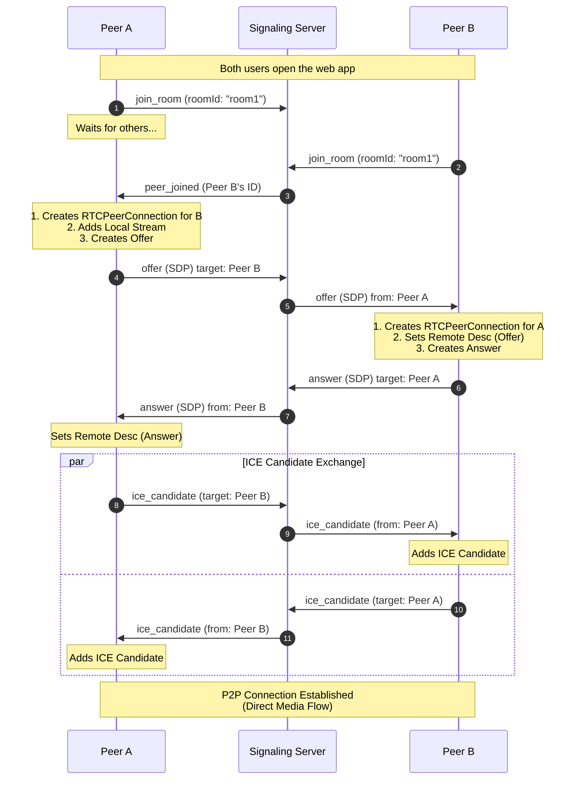

# WebRTC Video Call Demo

This project is a multi-user WebRTC video chat application built with a React frontend and a Python backend for signaling. It supports a **mesh network topology**, meaning each user connects directly to every other user in the room via Peer-to-Peer (P2P) connections.

## 1. Development Setup

### Backend (Signaling Server)
The signaling server manages the handshake between peers.

**Prerequisites:** Python 3.x

1.  Navigate to the backend directory:
    ```bash
    cd backend
    ```
2.  Install dependencies:
    ```bash
    pip install -r requirements.txt
    ```
3.  Start the server:
    ```bash
    python server.py
    ```
    *The server runs on **http://localhost:3000**.*

### Frontend (Web Client)
The frontend is a React application that manages the camera, microphone, and WebRTC peer connections.

**Prerequisites:** Node.js and npm

1.  Navigate to the webapp directory:
    ```bash
    cd webapp
    ```
2.  Install dependencies:
    ```bash
    npm install
    ```
3.  Start the development server:
    ```bash
    npm run dev
    ```
    *The app typically runs on **http://localhost:5173**.*

---

## 2. Architecture

### Topology: Full Mesh
In a room with 3 users (A, B, C):
*   **Peer A** has direct connections to **B** and **C**.
*   **Peer B** has direct connections to **A** and **C**.
*   **Peer C** has direct connections to **A** and **B**.

This decentralized approach reduces server load but increases upload bandwidth requirements for each client as the number of participants grows.

### Components
*   **Signaling Server (Python/Socket.IO):** Acts as a matchmaker. It relays small JSON messages (Signals) between peers so they can locate each other on the internet.
*   **STUN Server (Google):** A public server used by peers to discover their own public IP addresses (NAT traversal).
*   **Web Client (React):** Uses the browser's `RTCPeerConnection` API to establish P2P connections.

---

## 3. Data Flow & Signal Exchange

Before two peers can stream video, they must perform a "Handshake" (Signaling). This diagram shows the flow when **Peer B** joins a room already containing **Peer A**.



## 4. How to Connect
1. Open the frontend URL in **two or more separate browser tabs**.
2. Enter the **same Room ID** (e.g., "room1") in all tabs.
3. Click **Join Room** in the first tab and allow camera permissions.
4. Click **Join Room** in the subsequent tabs. As each user joins, they will establish a connection with all other users in the room.
